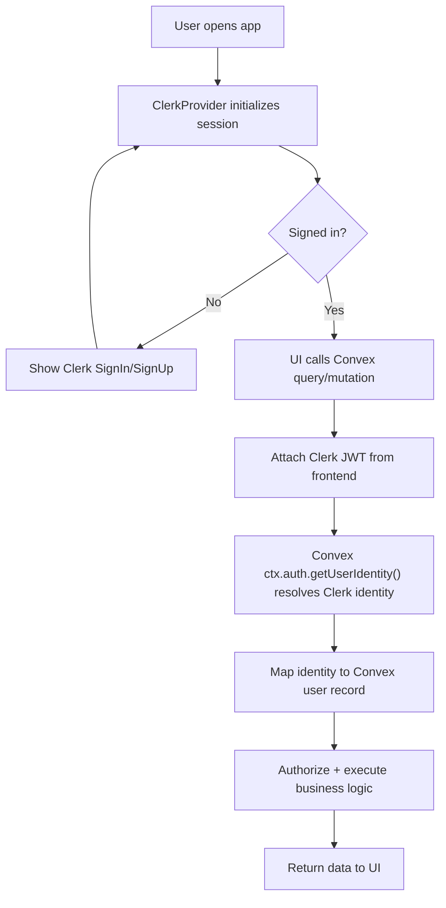
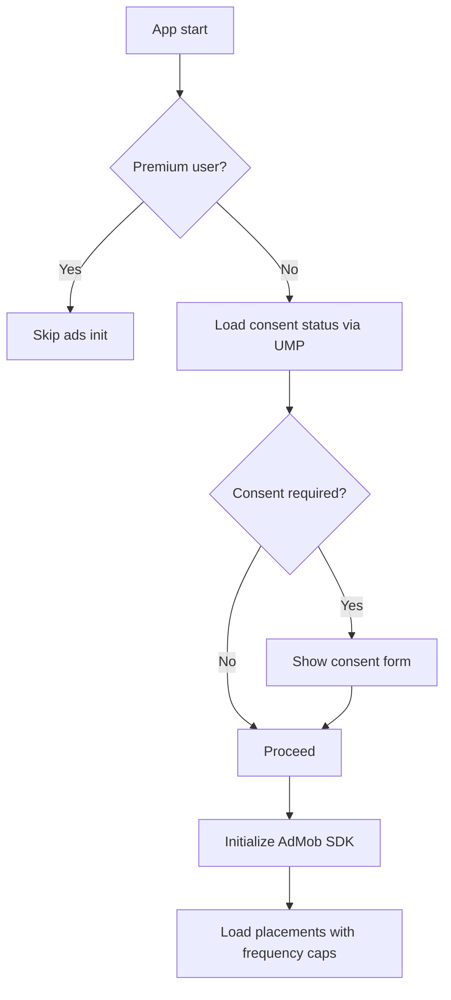

# FoodyLog - Technical Architecture Design

_Version 2.0 - August 2025_

## 📋 Overview

This document outlines the technical architecture for FoodyLog, a mobile-first food logging application built with React + Capacitor, Convex backend, and shadcn/ui components. Assumption: solo developer delivering MVP; choices favor simplicity, low ops overhead, and incremental evolution.

### Frontend Framework Decision

- Single codebase SPA (Web PWA + Mobile via Capacitor): React + TypeScript + Vite
- Routing: React Router (client-side)
- Build: Vite + @vitejs/plugin-react + vite-plugin-pwa

## 🏗️ System Architecture

### High-Level Architecture

```
┌───────────────────────────────────────────┐
│  FoodyLog App (SPA: React + Vite + Cap)   │
│   - Web PWA (dist/)                       │
│   - Native (Android/iOS via Capacitor)    │
└─────────────────────────────┬─────────────┘
                              │
                  ┌───────────┴───────────┐
                  │      Convex Backend   │
                  │ (Functions • DB • JWT │
                  │  File Storage)        │
                  └───────────┬───────────┘
                              │
                  ┌───────────┴───────────┐
                  │    External Services   │
                  │ • Clerk (Auth)         │
                  │ • Google Places        │
                  │ • Payments/Stores      │
                  │ • Push Notifications   │
                  └────────────────────────┘
```

## 📱 Mobile Application Architecture

### Development Quickstart (Bun)

```bash
# Install dependencies
bun install

# Run web (PWA) on localhost (accessible on LAN)
bun run dev   # Vite runs with --host per package.json

# Build web
bun run build

# Capacitor (first-time platform setup)
bunx cap add android
# bunx cap add ios

# Sync web build to native
bunx cap sync

# Run on Android (device/emulator)
bunx cap run android
```

### Technology Stack

```typescript
// Core Framework
React with TypeScript
Capacitor 7 for native mobile builds
 Vite 6+ for build tooling
 Bun for package management

// UI & Styling
shadcn/ui components (React 19 compatible)
Tailwind CSS for styling
Lucide React for icons
React Hook Form v7+ for form handling

// State Management & Data
Convex React hooks for data fetching
React 19 use() hook for data fetching
Zustand for local UI state (minimal)

// Navigation & Routing
React Router (SPA) with client-side routes
No Next.js; single bundle for web and Capacitor

// Offline & Storage
Convex client offline capabilities
Capacitor Preferences for device-specific data and offline queue

// Camera & Media
Capacitor Camera plugin
Capacitor Filesystem for local photo storage
Image compression libraries

// Development & Testing
Vitest for unit testing
Playwright for E2E testing
ESLint + Prettier for code quality
```

### Project Structure (Vite SPA + Capacitor + PWA)

```
app/
├── public/                    # Static assets (PWA icons, robots.txt)
├── src/
│   ├── assets/
│   ├── components/
│   ├── pages/                 # Route components (React Router)
│   ├── hooks/
│   ├── lib/                   # convex/, auth/, config/, utils
│   ├── stores/
│   ├── types/
│   ├── App.tsx
│   └── main.tsx
├── index.html
├── vite.config.ts
├── capacitor.config.ts
├── package.json
├── android/                   # Generated by Capacitor
└── ios/                       # Generated by Capacitor
```

Notes

- Single codebase: same SPA builds the web PWA (dist/) and is bundled by Capacitor.
- Routing with React Router (client-side). No Next.js app or file-based server routing.

### Live reload on device (Capacitor)

- Ensure Vite serves on your LAN IP: the dev script uses `--host`.
- Set `CAP_SERVER_URL` to the dev server URL reachable from the device/emulator.

```bash
# .env.example
# Android Emulator
CAP_SERVER_URL=http://10.0.2.2:5173
# Physical device (replace with your PC IP)
# CAP_SERVER_URL=http://192.168.1.123:5173
```

```bash
# Terminal 1 (web dev server)
bun run dev

# Terminal 2 (run native; uses CAP_SERVER_URL)
bunx cap run android --no-sync
```

Unset `CAP_SERVER_URL` to package the web bundle into the native app (`bun run build && bunx cap sync`).

### Component Architecture (SPA example)

```typescript
// Example: SPA page component
import { MealLogForm } from "~/components/meal/MealLogForm";
import { PageLayout } from "~/components/layout/PageLayout";

export default function MealNewPage() {
  return (
    <PageLayout>
      <MealLogForm />
    </PageLayout>
  );
}

// Feature Component with React 19 use() hook
const MealLogForm = ({ userPrefs, userTags }) => {
  const { capturePhoto } = useCamera();
  const { isOffline } = useOfflineStatus();

  // React 19 use() hook for async data
  const submit = useSubmit();

  return (
    <Card>
      <MealPhotoCapture onCapture={capturePhoto} />
      <MealDetailsForm onSubmit={submit} />
      <OfflineIndicator isOffline={isOffline} />
    </Card>
  );
};

// UI Components
const MealPhotoCapture = ({ onCapture }) => {
  return (
    <Button onClick={onCapture} className="w-full">
      <Camera className="mr-2 h-4 w-4" />
      Add Photo
    </Button>
  );
};
```

## 🔧 Backend Architecture (Convex)

### Convex Project Structure

```
convex/
├── schema.ts            # Database schema definition
├── auth.config.ts       # Authentication configuration
├── functions/           # Convex functions
│   ├── meals.ts         # Meal CRUD operations
│   ├── users.ts         # User management
│   ├── photos.ts        # Photo handling
│   ├── analytics.ts     # Analytics queries
│   ├── budgets.ts       # Budget tracking (Phase 2)
│   └── social.ts        # Social features (Phase 3)
├── lib/                 # Shared utilities
│   ├── validation.ts    # Server-side validation
│   ├── permissions.ts   # Access control helpers
│   └── utils.ts         # General utilities
└── http.ts              # HTTP actions for external APIs
```

### Database Schema Implementation

```typescript
// convex/schema.ts
import { defineSchema, defineTable } from "convex/server";
import { v } from "convex/values";

export default defineSchema({
  // Users table (managed by Clerk on frontend; mapped in Convex)
  users: defineTable({
    email: v.string(),
    name: v.optional(v.string()),
    avatar: v.optional(v.id("_storage")),
    preferences: v.object({
      defaultCurrency: v.string(),
      timezone: v.string(),
      units: v.union(v.literal("metric"), v.literal("imperial")),
      language: v.string(),
      region: v.string(),
      dateFormat: v.union(
        v.literal("DD/MM/YYYY"),
        v.literal("MM/DD/YYYY"),
        v.literal("YYYY/MM/DD")
      ),
      timeFormat: v.union(v.literal("12h"), v.literal("24h")),
      accessibility: v.object({
        highContrast: v.boolean(),
        fontSize: v.union(
          v.literal("small"),
          v.literal("medium"),
          v.literal("large"),
          v.literal("xlarge")
        ),
        reduceMotion: v.boolean(),
        screenReader: v.boolean(),
        voiceControl: v.boolean(),
      }),
      privacy: v.object({
        profilePublic: v.boolean(),
        mealsPublic: v.boolean(),
        allowFollowers: v.boolean(),
      }),
    }),
    stats: v.object({
      totalMeals: v.number(),
      totalSpent: v.number(),
      averageRating: v.number(),
      favoritesCuisine: v.optional(v.string()),
    }),
    subscription: v.object({
      tier: v.union(v.literal("free"), v.literal("premium")),
      expiresAt: v.optional(v.number()),
      provider: v.optional(
        v.union(v.literal("appstore"), v.literal("play"), v.literal("web"))
      ),
      externalRef: v.optional(v.string()),
    }),
  })
    .index("by_email", ["email"])
    .index("by_subscription", ["subscription.tier"]),

  // Meals table with MVP/Premium field separation
  meals: defineTable({
    userId: v.id("users"),
    title: v.string(),
    rating: v.number(),
    price: v.optional(v.number()),
    dateEaten: v.number(),
    mealType: v.union(
      v.literal("breakfast"),
      v.literal("lunch"),
      v.literal("dinner"),
      v.literal("snack")
    ),

    // MVP fields
    locationText: v.optional(v.string()),
    tags: v.array(v.string()),

    // Premium/Phase 2 fields
    description: v.optional(v.string()),
    mealTypeExtended: v.optional(
      v.union(v.literal("dessert"), v.literal("drink"), v.literal("brunch"))
    ),

    // Location data (Premium)
    location: v.optional(
      v.object({
        name: v.string(),
        address: v.optional(v.string()),
        city: v.optional(v.string()),
        country: v.optional(v.string()),
        coordinates: v.optional(
          v.object({
            lat: v.number(),
            lng: v.number(),
          })
        ),
        placeId: v.optional(v.string()),
      })
    ),

    // Meal details (Premium)
    cuisine: v.optional(v.string()),
    dishType: v.optional(v.string()),
    servingSize: v.optional(
      v.union(
        v.literal("small"),
        v.literal("medium"),
        v.literal("large"),
        v.literal("sharing")
      )
    ),
    spiceLevel: v.optional(v.number()),

    // Social fields (Premium)
    isPublic: v.boolean(),
    allowComments: v.boolean(),
    likeCount: v.number(),
    commentCount: v.number(),
    shareCount: v.number(),

    // Premium metadata
    notes: v.optional(v.string()),
    occasion: v.optional(v.string()),
    companions: v.optional(v.array(v.string())),

    // Premium tracking
    isRecommended: v.optional(v.boolean()),
    wouldOrderAgain: v.optional(v.boolean()),
    valueForMoney: v.optional(v.number()),
  })
    .index("by_user", ["userId"])
    .index("by_user_date", ["userId", "dateEaten"])
    .index("by_public", ["isPublic"])
    .index("by_user_type", ["userId", "mealType"])
    .searchIndex("search_meals", {
      searchField: "title",
      filterFields: ["userId", "isPublic"],
    }),

  // Photos table
  mealPhotos: defineTable({
    mealId: v.id("meals"),
    storageId: v.id("_storage"),
    fileName: v.string(),
    fileSize: v.number(),
    mimeType: v.string(),
    width: v.optional(v.number()),
    height: v.optional(v.number()),
    isPrimary: v.boolean(),
    caption: v.optional(v.string()),
    order: v.number(),
  })
    .index("by_meal", ["mealId"])
    .index("by_meal_primary", ["mealId", "isPrimary"])
    .index("by_user_storage", ["mealId"]), // For storage quota calculations

  // User storage quota tracking
  userStorageQuota: defineTable({
    userId: v.id("users"),
    totalUsed: v.number(),
    photoCount: v.number(),
    lastCalculated: v.number(),
  }).index("by_user", ["userId"]),

  // User tags for autocomplete
  userTags: defineTable({
    userId: v.id("users"),
    name: v.string(),
    usageCount: v.number(),
    lastUsed: v.number(),
  })
    .index("by_user", ["userId"])
    .index("by_user_usage", ["userId", "usageCount"]),
});
```

### Convex Functions Implementation

```typescript
// convex/functions/meals.ts
import { mutation, query } from "./_generated/server";
import { v } from "convex/values";
import { getCurrentUser, requireAuth } from "./lib/auth";
import { validateMealData } from "./lib/validation";

// Create meal (MVP version)
export const createMeal = mutation({
  args: {
    title: v.string(),
    rating: v.number(),
    price: v.optional(v.number()),
    dateEaten: v.number(),
    mealType: v.union(
      v.literal("breakfast"),
      v.literal("lunch"),
      v.literal("dinner"),
      v.literal("snack")
    ),
    locationText: v.optional(v.string()),
    tags: v.array(v.string()),
  },
  handler: async (ctx, args) => {
    const user = await requireAuth(ctx);

    // Validate input
    const validatedData = validateMealData(args);

    // Check free tier limits
    if (user.subscription.tier === "free") {
      if (args.tags.length > 3) {
        throw new Error("Free tier limited to 3 tags per meal");
      }
    }

    // Create meal
    const mealId = await ctx.db.insert("meals", {
      userId: user._id,
      ...validatedData,
      isPublic: false,
      allowComments: false,
      likeCount: 0,
      commentCount: 0,
      shareCount: 0,
    });

    // Update user stats
    await updateUserStats(ctx, user._id);

    // Update tag usage
    await updateTagUsage(ctx, user._id, args.tags);

    return mealId;
  },
});

// Get user meals with pagination
export const getUserMeals = query({
  args: {
    paginationOpts: v.object({
      numItems: v.number(),
      cursor: v.optional(v.string()),
    }),
  },
  handler: async (ctx, args) => {
    const user = await requireAuth(ctx);

    return await ctx.db
      .query("meals")
      .withIndex("by_user_date", (q) => q.eq("userId", user._id))
      .order("desc")
      .paginate(args.paginationOpts);
  },
});

// Search meals (basic for MVP, enhanced for premium)
export const searchMeals = query({
  args: {
    searchTerm: v.string(),
    limit: v.optional(v.number()),
  },
  handler: async (ctx, args) => {
    const user = await requireAuth(ctx);
    const limit = args.limit || 20;

    // MVP: Simple title search
    if (user.subscription.tier === "free") {
      return await ctx.db
        .query("meals")
        .withSearchIndex("search_meals", (q) =>
          q.search("title", args.searchTerm).eq("userId", user._id)
        )
        .take(limit);
    }

    // Premium: Enhanced search (Phase 2)
    // TODO: Implement advanced search with filters
    return await ctx.db
      .query("meals")
      .withSearchIndex("search_meals", (q) =>
        q.search("title", args.searchTerm).eq("userId", user._id)
      )
      .take(limit);
  },
});

// Helper functions
async function updateUserStats(ctx: any, userId: string) {
  const user = await ctx.db.get(userId);
  const meals = await ctx.db
    .query("meals")
    .withIndex("by_user", (q) => q.eq("userId", userId))
    .collect();

  const totalMeals = meals.length;
  const totalSpent = meals.reduce((sum, meal) => sum + (meal.price || 0), 0);
  const averageRating =
    meals.reduce((sum, meal) => sum + meal.rating, 0) / totalMeals;

  await ctx.db.patch(userId, {
    stats: {
      ...user.stats,
      totalMeals,
      totalSpent,
      averageRating,
    },
  });
}

async function updateTagUsage(ctx: any, userId: string, tags: string[]) {
  for (const tagName of tags) {
    const existingTag = await ctx.db
      .query("userTags")
      .withIndex("by_user", (q) => q.eq("userId", userId))
      .filter((q) => q.eq(q.field("name"), tagName))
      .first();

    if (existingTag) {
      await ctx.db.patch(existingTag._id, {
        usageCount: existingTag.usageCount + 1,
        lastUsed: Date.now(),
      });
    } else {
      await ctx.db.insert("userTags", {
        userId,
        name: tagName,
        usageCount: 1,
        lastUsed: Date.now(),
      });
    }
  }
}
```

### Photo Handling System

```typescript
// convex/functions/photos.ts
import { mutation, action } from "./_generated/server";
import { v } from "convex/values";
import { requireAuth } from "./lib/auth";

// Upload photo action
export const uploadPhoto = action({
  args: {
    mealId: v.id("meals"),
    file: v.any(), // File data
    fileName: v.string(),
    mimeType: v.string(),
    isPrimary: v.boolean(),
    caption: v.optional(v.string()),
  },
  handler: async (ctx, args) => {
    const user = await requireAuth(ctx);

    // Check storage quota for free users
    if (user.subscription.tier === "free") {
      const quota = await ctx.runQuery("getUserStorageQuota", {
        userId: user._id,
      });
      if (quota.totalUsed + args.file.size > 100 * 1024 * 1024) {
        // 100MB limit
        throw new Error(
          "Storage quota exceeded. Upgrade to premium for unlimited storage."
        );
      }
    }

    // Upload to Convex storage
    const storageId = await ctx.storage.store(args.file);

    // Create photo record
    const photoId = await ctx.runMutation("createPhotoRecord", {
      mealId: args.mealId,
      storageId,
      fileName: args.fileName,
      fileSize: args.file.size,
      mimeType: args.mimeType,
      isPrimary: args.isPrimary,
      caption: args.caption,
    });

    // Update storage quota
    await ctx.runMutation("updateStorageQuota", {
      userId: user._id,
      additionalBytes: args.file.size,
    });

    return photoId;
  },
});

// Create photo record mutation
export const createPhotoRecord = mutation({
  args: {
    mealId: v.id("meals"),
    storageId: v.id("_storage"),
    fileName: v.string(),
    fileSize: v.number(),
    mimeType: v.string(),
    isPrimary: v.boolean(),
    caption: v.optional(v.string()),
  },
  handler: async (ctx, args) => {
    const user = await requireAuth(ctx);

    // Verify meal ownership
    const meal = await ctx.db.get(args.mealId);
    if (!meal || meal.userId !== user._id) {
      throw new Error("Meal not found or access denied");
    }

    // Check photo limits for free users
    if (user.subscription.tier === "free") {
      const existingPhotos = await ctx.db
        .query("mealPhotos")
        .withIndex("by_meal", (q) => q.eq("mealId", args.mealId))
        .collect();

      if (existingPhotos.length >= 1) {
        throw new Error("Free tier limited to 1 photo per meal");
      }
    }

    // Get next order number
    const existingPhotos = await ctx.db
      .query("mealPhotos")
      .withIndex("by_meal", (q) => q.eq("mealId", args.mealId))
      .collect();

    const order = existingPhotos.length;

    return await ctx.db.insert("mealPhotos", {
      ...args,
      order,
    });
  },
});
```

## 🔄 Offline Architecture

### Offline Strategy

```typescript
// hooks/useOfflineSync.ts
import { useEffect, useState } from "react";
import { useConvexAuth } from "convex/react";
import { Preferences } from "@capacitor/preferences";

interface OfflineAction {
  id: string;
  type: "CREATE_MEAL" | "UPDATE_MEAL" | "DELETE_MEAL" | "UPLOAD_PHOTO";
  data: any;
  timestamp: number;
  retryCount: number;
}

export const useOfflineSync = () => {
  const { isAuthenticated } = useConvexAuth();
  const [isOnline, setIsOnline] = useState(navigator.onLine);
  const [pendingActions, setPendingActions] = useState<OfflineAction[]>([]);

  // Monitor online status
  useEffect(() => {
    const handleOnline = () => setIsOnline(true);
    const handleOffline = () => setIsOnline(false);

    window.addEventListener("online", handleOnline);
    window.addEventListener("offline", handleOffline);

    return () => {
      window.removeEventListener("online", handleOnline);
      window.removeEventListener("offline", handleOffline);
    };
  }, []);

  // Load pending actions from Capacitor Preferences (avoid localStorage)
  useEffect(() => {
    const loadPendingActions = async () => {
      try {
        const { value } = await Preferences.get({
          key: "foodylog_offline_actions",
        });
        if (value) setPendingActions(JSON.parse(value));
      } catch (error) {
        console.error("Failed to load offline actions:", error);
      }
    };

    loadPendingActions();
  }, []);

  // Sync when coming online
  useEffect(() => {
    if (isOnline && isAuthenticated && pendingActions.length > 0) {
      syncPendingActions();
    }
  }, [isOnline, isAuthenticated, pendingActions]);

  const queueAction = (
    action: Omit<OfflineAction, "id" | "timestamp" | "retryCount">
  ) => {
    const newAction: OfflineAction = {
      ...action,
      id: crypto.randomUUID(),
      timestamp: Date.now(),
      retryCount: 0,
    };

    const updatedActions = [...pendingActions, newAction];
    setPendingActions(updatedActions);
    await Preferences.set({
      key: "foodylog_offline_actions",
      value: JSON.stringify(updatedActions),
    });
  };

  const syncPendingActions = async () => {
    for (const action of pendingActions) {
      try {
        await executeAction(action);
        // Remove successful action
        const updatedActions = pendingActions.filter((a) => a.id !== action.id);
        setPendingActions(updatedActions);
        await Preferences.set({
          key: "foodylog_offline_actions",
          value: JSON.stringify(updatedActions),
        });
      } catch (error) {
        console.error(`Failed to sync action ${action.id}:`, error);
        // Increment retry count
        action.retryCount++;
        if (action.retryCount >= 3) {
          // Remove failed action after 3 retries
          const updatedActions = pendingActions.filter(
            (a) => a.id !== action.id
          );
          setPendingActions(updatedActions);
          await Preferences.set({
            key: "foodylog_offline_actions",
            value: JSON.stringify(updatedActions),
          });
        }
      }
    }
  };

  const executeAction = async (action: OfflineAction) => {
    // Implementation depends on Convex client methods
    switch (action.type) {
      case "CREATE_MEAL":
        // await convex.mutation(api.meals.createMeal, action.data);
        break;
      case "UPDATE_MEAL":
        // await convex.mutation(api.meals.updateMeal, action.data);
        break;
      // ... other actions
    }
  };

  return {
    isOnline,
    pendingActions: pendingActions.length,
    queueAction,
  };
};
```

### Capacitor 7 Storage Strategy

```typescript
// lib/storage.ts
import { Preferences } from "@capacitor/preferences";
import { Filesystem, Directory, Encoding } from "@capacitor/filesystem";

export class LocalStorage {
  // Capacitor 7 improved preferences with groups
  private static readonly MEAL_GROUP = "foodylog_meals";
  private static readonly PHOTO_GROUP = "foodylog_photos";

  // Store meal data locally
  static async storeMeal(meal: any): Promise<void> {
    const key = `meal_${meal.id}`;
    await Preferences.set({
      key,
      value: JSON.stringify(meal),
      group: this.MEAL_GROUP, // Capacitor 7 feature
    });
  }

  // Store photo locally using Filesystem API
  static async storePhoto(photoId: string, photoData: string): Promise<string> {
    try {
      const fileName = `photo_${photoId}.jpg`;
      const result = await Filesystem.writeFile({
        path: fileName,
        data: photoData,
        directory: Directory.Documents,
        encoding: Encoding.UTF8,
      });

      // Store reference in preferences
      await Preferences.set({
        key: `photo_ref_${photoId}`,
        value: result.uri,
        group: this.PHOTO_GROUP,
      });

      return result.uri;
    } catch (error) {
      console.error("Failed to store photo:", error);
      throw error;
    }
  }

  // Get offline meals
  static async getOfflineMeals(): Promise<any[]> {
    try {
      const { keys } = await Preferences.keys({ group: this.MEAL_GROUP });
      const mealKeys = keys.filter((key) => key.startsWith("meal_"));

      const meals = await Promise.all(
        mealKeys.map(async (key) => {
          const { value } = await Preferences.get({
            key,
            group: this.MEAL_GROUP,
          });
          return value ? JSON.parse(value) : null;
        })
      );

      return meals
        .filter((meal) => meal !== null)
        .sort((a, b) => b.dateEaten - a.dateEaten);
    } catch (error) {
      console.error("Failed to get offline meals:", error);
      return [];
    }
  }

  // Get photo data
  static async getPhoto(photoId: string): Promise<string | null> {
    try {
      const { value: photoUri } = await Preferences.get({
        key: `photo_ref_${photoId}`,
        group: this.PHOTO_GROUP,
      });

      if (!photoUri) return null;

      const result = await Filesystem.readFile({
        path: photoUri,
        encoding: Encoding.UTF8,
      });

      return result.data;
    } catch (error) {
      console.error("Failed to get photo:", error);
      return null;
    }
  }

  // Clear synced data with improved error handling
  static async clearSyncedData(syncedIds: string[]): Promise<void> {
    const clearPromises = syncedIds.map(async (id) => {
      try {
        // Clear meal data
        await Preferences.remove({
          key: `meal_${id}`,
          group: this.MEAL_GROUP,
        });

        // Clear photo reference
        await Preferences.remove({
          key: `photo_ref_${id}`,
          group: this.PHOTO_GROUP,
        });

        // Remove photo file
        try {
          await Filesystem.deleteFile({
            path: `photo_${id}.jpg`,
            directory: Directory.Documents,
          });
        } catch (fileError) {
          // Photo file might not exist, continue
          console.warn(`Photo file for ${id} not found:`, fileError);
        }
      } catch (error) {
        console.error(`Failed to clear data for ${id}:`, error);
      }
    });

    await Promise.allSettled(clearPromises);
  }

  // Capacitor 7 storage info
  static async getStorageInfo(): Promise<{
    totalSpace: number;
    freeSpace: number;
    usedSpace: number;
  }> {
    try {
      const stat = await Filesystem.stat({
        path: "",
        directory: Directory.Documents,
      });

      return {
        totalSpace: stat.size || 0,
        freeSpace: 0, // Not available in Capacitor
        usedSpace: stat.size || 0,
      };
    } catch (error) {
      console.error("Failed to get storage info:", error);
      return { totalSpace: 0, freeSpace: 0, usedSpace: 0 };
    }
  }
}

// Suspense-compatible storage hook (optional)
export function useOfflineStorage() {
  const [meals, setMeals] = useState<any[]>([]);
  const [isLoading, setIsLoading] = useState(true);

  useEffect(() => {
    LocalStorage.getOfflineMeals()
      .then(setMeals)
      .finally(() => setIsLoading(false));
  }, []);

  const storeMeal = useCallback(async (meal: any) => {
    await LocalStorage.storeMeal(meal);
    setMeals((prev) => [meal, ...prev.filter((m) => m.id !== meal.id)]);
  }, []);

  return { meals, storeMeal, isLoading };
}
```

## 📸 Camera Integration

### Capacitor 7 Camera Hook Implementation

```typescript
// hooks/useCamera.ts
import {
  Camera,
  CameraResultType,
  CameraSource,
  Photo,
} from "@capacitor/camera";
import { Filesystem, Directory, Encoding } from "@capacitor/filesystem";
import { useState, useCallback } from "react";

export const useCamera = () => {
  const [isCapturing, setIsCapturing] = useState(false);

  const capturePhoto = useCallback(async (): Promise<Photo | null> => {
    try {
      setIsCapturing(true);

      const image = await Camera.getPhoto({
        quality: 80,
        allowEditing: true, // Capacitor 7 improved editing
        resultType: CameraResultType.Uri, // Use Uri for better performance
        source: CameraSource.Camera,
        width: 1024,
        height: 1024,
        // Capacitor 7 new options
        correctOrientation: true,
        saveToGallery: false,
        promptLabelHeader: "Select Photo Source",
        promptLabelCancel: "Cancel",
        promptLabelPhoto: "From Photos",
        promptLabelPicture: "Take Picture",
      });

      return image;
    } catch (error) {
      console.error("Camera capture failed:", error);
      return null;
    } finally {
      setIsCapturing(false);
    }
  }, []);

  const selectFromGallery = useCallback(async (): Promise<Photo | null> => {
    try {
      setIsCapturing(true);

      const image = await Camera.getPhoto({
        quality: 80,
        allowEditing: true,
        resultType: CameraResultType.Uri,
        source: CameraSource.Photos,
        width: 1024,
        height: 1024,
        correctOrientation: true,
      });

      return image;
    } catch (error) {
      console.error("Gallery selection failed:", error);
      return null;
    } finally {
      setIsCapturing(false);
    }
  }, []);

  // Capacitor 7 improved file handling
  const savePhotoToDevice = useCallback(
    async (photo: Photo, fileName: string) => {
      try {
        if (photo.path) {
          const savedFile = await Filesystem.copy({
            from: photo.path,
            to: fileName,
            directory: Directory.Documents,
          });
          return savedFile.uri;
        }
        return null;
      } catch (error) {
        console.error("Failed to save photo:", error);
        return null;
      }
    },
    []
  );

  // Convert photo to base64 for upload
  const photoToBase64 = useCallback(
    async (photo: Photo): Promise<string | null> => {
      try {
        if (photo.path) {
          const file = await Filesystem.readFile({
            path: photo.path,
          });
          return `data:image/jpeg;base64,${file.data}`;
        }
        return null;
      } catch (error) {
        console.error("Failed to convert photo to base64:", error);
        return null;
      }
    },
    []
  );

  return {
    capturePhoto,
    selectFromGallery,
    savePhotoToDevice,
    photoToBase64,
    isCapturing,
  };
};
```

### Image Optimization

```typescript
// lib/imageUtils.ts
export class ImageUtils {
  static async compressImage(
    dataUrl: string,
    maxSizeMB: number = 1
  ): Promise<string> {
    return new Promise((resolve) => {
      const canvas = document.createElement("canvas");
      const ctx = canvas.getContext("2d")!;
      const img = new Image();

      img.onload = () => {
        // Calculate new dimensions
        const maxWidth = 1024;
        const maxHeight = 1024;
        let { width, height } = img;

        if (width > height) {
          if (width > maxWidth) {
            height = (height * maxWidth) / width;
            width = maxWidth;
          }
        } else {
          if (height > maxHeight) {
            width = (width * maxHeight) / height;
            height = maxHeight;
          }
        }

        canvas.width = width;
        canvas.height = height;

        // Draw and compress
        ctx.drawImage(img, 0, 0, width, height);

        // Start with high quality and reduce until size is acceptable
        let quality = 0.9;
        let compressedDataUrl = canvas.toDataURL("image/jpeg", quality);

        while (
          this.getDataUrlSize(compressedDataUrl) > maxSizeMB * 1024 * 1024 &&
          quality > 0.1
        ) {
          quality -= 0.1;
          compressedDataUrl = canvas.toDataURL("image/jpeg", quality);
        }

        resolve(compressedDataUrl);
      };

      img.src = dataUrl;
    });
  }

  private static getDataUrlSize(dataUrl: string): number {
    const base64 = dataUrl.split(",")[1];
    return (base64.length * 3) / 4;
  }

  static async generateThumbnail(
    dataUrl: string,
    size: number = 200
  ): Promise<string> {
    return new Promise((resolve) => {
      const canvas = document.createElement("canvas");
      const ctx = canvas.getContext("2d")!;
      const img = new Image();

      img.onload = () => {
        canvas.width = size;
        canvas.height = size;

        // Calculate crop area for square thumbnail
        const minDimension = Math.min(img.width, img.height);
        const x = (img.width - minDimension) / 2;
        const y = (img.height - minDimension) / 2;

        ctx.drawImage(img, x, y, minDimension, minDimension, 0, 0, size, size);
        resolve(canvas.toDataURL("image/jpeg", 0.8));
      };

      img.src = dataUrl;
    });
  }
}
```

This is the first part of the technical architecture.

## 🔐 Authentication & Security (Clerk)

### Clerk Integration Overview

```typescript
// Frontend (SPA with react-router-dom): wrap the app with ClerkProvider
// src/App.tsx (sketch)
import { ClerkProvider } from '@clerk/clerk-react';
import { Outlet } from 'react-router';

export default function AppRoot() {
  return (
    <ClerkProvider publishableKey={import.meta.env.VITE_CLERK_PUBLISHABLE_KEY}>
      <Outlet />
    </ClerkProvider>
  );
}

// Backend (Convex): use ctx.auth.getUserIdentity() which reflects Clerk when configured
// convex/lib/auth.ts (Clerk-aware mapping)
import { QueryCtx, MutationCtx } from "./_generated/server";

export async function getCurrentUser(ctx: QueryCtx | MutationCtx) {
  const identity = await ctx.auth.getUserIdentity();
  if (!identity) return null;
  const user = await ctx.db
    .query("users")
    .withIndex("by_email", (q) => q.eq("email", identity.email!))
    .first();
  return user;
}
```

### Clerk → Convex Auth Flow



### Security Middleware

```typescript
// convex/lib/auth.ts
import { QueryCtx, MutationCtx } from "./_generated/server";

export async function getCurrentUser(ctx: QueryCtx | MutationCtx) {
  const identity = await ctx.auth.getUserIdentity();
  if (!identity) {
    return null;
  }

  const user = await ctx.db
    .query("users")
    .withIndex("by_email", (q) => q.eq("email", identity.email!))
    .first();

  return user;
}

export async function requireAuth(ctx: QueryCtx | MutationCtx) {
  const user = await getCurrentUser(ctx);
  if (!user) throw new Error("Authentication required (Clerk)");
  return user;
}

export async function requirePremium(ctx: QueryCtx | MutationCtx) {
  const user = await requireAuth(ctx);
  if (user.subscription.tier !== "premium") {
    throw new Error("Premium subscription required");
  }
  return user;
}

// Rate limiting helper
const rateLimits = new Map<string, { count: number; resetTime: number }>();

export function rateLimit(
  identifier: string,
  maxRequests: number,
  windowMs: number
) {
  const now = Date.now();
  const limit = rateLimits.get(identifier);

  if (!limit || now > limit.resetTime) {
    rateLimits.set(identifier, { count: 1, resetTime: now + windowMs });
    return true;
  }

  if (limit.count >= maxRequests) {
    throw new Error("Rate limit exceeded");
  }

  limit.count++;
  return true;
}
```

### Data Validation

```typescript
// convex/lib/validation.ts
import { v } from "convex/values";

export const mealValidation = {
  title: (title: string) => {
    if (!title || title.trim().length === 0) {
      throw new Error("Title is required");
    }
    if (title.length > 100) {
      throw new Error("Title must be less than 100 characters");
    }
    return title.trim();
  },

  rating: (rating: number) => {
    if (rating < 1 || rating > 10) {
      throw new Error("Rating must be between 1 and 10");
    }
    return Math.round(rating);
  },

  price: (price?: number) => {
    if (price !== undefined) {
      if (price < 0 || price > 99999.99) {
        throw new Error("Price must be between 0 and 99999.99");
      }
    }
    return price;
  },

  tags: (tags: string[], userTier: "free" | "premium") => {
    const maxTags = userTier === "free" ? 3 : 10;
    if (tags.length > maxTags) {
      throw new Error(`Maximum ${maxTags} tags allowed`);
    }

    return tags
      .map((tag) => tag.trim())
      .filter((tag) => tag.length > 0)
      .slice(0, maxTags)
      .map((tag) => {
        if (tag.length > 30) {
          throw new Error("Tags must be less than 30 characters");
        }
        return tag;
      });
  },
};

export function validateMealData(data: any) {
  return {
    title: mealValidation.title(data.title),
    rating: mealValidation.rating(data.rating),
    price: mealValidation.price(data.price),
    tags: mealValidation.tags(data.tags, data.userTier || "free"),
    dateEaten: data.dateEaten,
    mealType: data.mealType,
    locationText: data.locationText?.trim() || undefined,
  };
}
```

## ⚡ Performance Optimization

### Useful React Data Patterns with Convex

```typescript
// hooks/useMeals.ts
import { use, useOptimistic, useActionState } from "react";
import { useQuery, usePaginatedQuery } from "convex/react";
import { api } from "../convex/_generated/api";

export const useMeals = (limit: number = 20) => {
  return usePaginatedQuery(
    api.meals.getUserMeals,
    {},
    { initialNumItems: limit }
  );
};

export const useMealSearch = (searchTerm: string) => {
  return useQuery(
    api.meals.searchMeals,
    searchTerm.length > 0 ? { searchTerm } : "skip"
  );
};

// useOptimistic for better UX
export const useOptimisticMeals = () => {
  const meals = useMeals();

  const [optimisticMeals, addOptimisticMeal] = useOptimistic(
    meals.results || [],
    (state, newMeal) => [
      {
        ...newMeal,
        _id: `temp_${Date.now()}`,
        _creationTime: Date.now(),
        isOptimistic: true,
      },
      ...state,
    ]
  );

  return {
    meals: optimisticMeals,
    addOptimisticMeal,
    isLoading: meals.isLoading,
    loadMore: meals.loadMore,
  };
};

// useActionState for form handling
export const useMealForm = () => {
  const [state, formAction, isPending] = useActionState(
    async (prevState: any, formData: FormData) => {
      try {
        const mealData = Object.fromEntries(formData);
        // Validate and submit meal
        const result = await submitMeal(mealData);
        return { success: true, data: result };
      } catch (error) {
        return { success: false, error: error.message };
      }
    },
    { success: false, data: null, error: null }
  );

  return { state, formAction, isPending };
};

// use() hook for async data (optional on React 19)
export const MealDetails = ({ mealId }: { mealId: string }) => {
  // use() hook can handle promises directly
  const meal = use(fetchMeal(mealId));

  return (
    <div>
      <h1>{meal.title}</h1>
      <p>Rating: {meal.rating}/10</p>
    </div>
  );
};

async function fetchMeal(id: string) {
  // This would typically be a Convex query
  return convex.query(api.meals.getMeal, { id });
}
```

### Image Lazy Loading

```typescript
// components/LazyImage.tsx
import { useState, useRef, useEffect } from 'react';

interface LazyImageProps {
  src: string;
  alt: string;
  className?: string;
  placeholder?: string;
}

export const LazyImage: React.FC<LazyImageProps> = ({
  src,
  alt,
  className,
  placeholder = '/placeholder-meal.jpg',
}) => {
  const [isLoaded, setIsLoaded] = useState(false);
  const [isInView, setIsInView] = useState(false);
  const imgRef = useRef<HTMLImageElement>(null);

  useEffect(() => {
    const observer = new IntersectionObserver(
      ([entry]) => {
        if (entry.isIntersecting) {
          setIsInView(true);
          observer.disconnect();
        }
      },
      { threshold: 0.1 }
    );

    if (imgRef.current) {
      observer.observe(imgRef.current);
    }

    return () => observer.disconnect();
  }, []);

  return (
    <div className={`relative overflow-hidden ${className}`}>
       setIsLoaded(true)}
      />
      {!isLoaded && (
        <div className="absolute inset-0 bg-gray-200 animate-pulse" />
      )}
    </div>
  );
};
```

### Caching Strategy

```typescript
// lib/cache.ts
class CacheManager {
  private cache = new Map<
    string,
    { data: any; timestamp: number; ttl: number }
  >();

  set(key: string, data: any, ttlMs: number = 5 * 60 * 1000) {
    this.cache.set(key, {
      data,
      timestamp: Date.now(),
      ttl: ttlMs,
    });
  }

  get(key: string) {
    const item = this.cache.get(key);
    if (!item) return null;

    if (Date.now() - item.timestamp > item.ttl) {
      this.cache.delete(key);
      return null;
    }

    return item.data;
  }

  clear() {
    this.cache.clear();
  }

  // Cache user preferences for quick access
  cacheUserPreferences(userId: string, preferences: any) {
    this.set(`user_prefs_${userId}`, preferences, 30 * 60 * 1000); // 30 minutes
  }

  getUserPreferences(userId: string) {
    return this.get(`user_prefs_${userId}`);
  }
}

export const cacheManager = new CacheManager();
```

## 🧪 Testing Strategy

### Unit Testing Setup

```typescript
// vitest.config.ts
import { defineConfig } from "vitest/config";
import react from "@vitejs/plugin-react";

export default defineConfig({
  plugins: [react()],
  test: {
    environment: "jsdom",
    setupFiles: ["./src/test/setup.ts"],
    globals: true,
  },
});

// src/test/setup.ts
import "@testing-library/jest-dom";
import { vi } from "vitest";

// Mock Capacitor
vi.mock("@capacitor/camera", () => ({
  Camera: {
    getPhoto: vi.fn(),
  },
}));

vi.mock("@capacitor/preferences", () => ({
  Preferences: {
    set: vi.fn(),
    get: vi.fn(),
    remove: vi.fn(),
    keys: vi.fn(),
  },
}));
```

### Component Testing

```typescript
// src/components/__tests__/MealCard.test.tsx
import { render, screen } from '@testing-library/react';
import { MealCard } from '../MealCard';

const mockMeal = {
  _id: '1',
  title: 'Test Meal',
  rating: 8,
  dateEaten: Date.now(),
  mealType: 'lunch' as const,
  tags: ['delicious', 'healthy'],
  locationText: 'Home',
};

describe('MealCard', () => {
  it('renders meal information correctly', () => {
    render(<MealCard meal={mockMeal} />);

    expect(screen.getByText('Test Meal')).toBeInTheDocument();
    expect(screen.getByText('8/10')).toBeInTheDocument();
    expect(screen.getByText('delicious')).toBeInTheDocument();
    expect(screen.getByText('healthy')).toBeInTheDocument();
  });

  it('handles missing optional fields', () => {
    const minimalMeal = {
      ...mockMeal,
      locationText: undefined,
      tags: [],
    };

    render(<MealCard meal={minimalMeal} />);
    expect(screen.getByText('Test Meal')).toBeInTheDocument();
  });
});
```

### E2E Testing with Playwright

```typescript
// tests/meal-logging.spec.ts
import { test, expect } from "@playwright/test";

test.describe("Meal Logging", () => {
  test.beforeEach(async ({ page }) => {
    // Mock authentication
    await page.goto("/login");
    await page.fill("[data-testid=email]", "test@example.com");
    await page.fill("[data-testid=password]", "password123");
    await page.click("[data-testid=login-button]");
    await expect(page).toHaveURL("/meals");
  });

  test("should log a new meal", async ({ page }) => {
    await page.click("[data-testid=add-meal-button]");

    // Fill meal form
    await page.fill("[data-testid=meal-title]", "Delicious Pizza");
    await page.selectOption("[data-testid=meal-type]", "dinner");
    await page.fill("[data-testid=meal-rating]", "9");
    await page.fill("[data-testid=meal-location]", "Tony's Pizza");
    await page.fill("[data-testid=meal-tags]", "pizza, italian, cheesy");

    // Submit form
    await page.click("[data-testid=save-meal-button]");

    // Verify meal appears in list
    await expect(page.locator("[data-testid=meal-list]")).toContainText(
      "Delicious Pizza"
    );
    await expect(page.locator("[data-testid=meal-list]")).toContainText("9/10");
  });

  test("should work offline", async ({ page, context }) => {
    // Go offline
    await context.setOffline(true);

    await page.click("[data-testid=add-meal-button]");
    await page.fill("[data-testid=meal-title]", "Offline Meal");
    await page.selectOption("[data-testid=meal-type]", "lunch");
    await page.fill("[data-testid=meal-rating]", "7");

    await page.click("[data-testid=save-meal-button]");

    // Should show offline indicator
    await expect(page.locator("[data-testid=offline-indicator]")).toBeVisible();

    // Meal should appear in local list
    await expect(page.locator("[data-testid=meal-list]")).toContainText(
      "Offline Meal"
    );

    // Go back online
    await context.setOffline(false);

    // Should sync and hide offline indicator
    await expect(
      page.locator("[data-testid=offline-indicator]")
    ).not.toBeVisible();
  });
});
```

### Accessibility Testing

FoodyLog includes comprehensive accessibility testing utilities to ensure WCAG 2.1 AA compliance across all components.

```typescript
// src/test/accessibility.ts - Custom accessibility testing utilities
import { configureAxe } from 'jest-axe';
import type { RenderResult } from '@testing-library/react';

// Configure axe-core for FoodyLog's design system
export const axe = configureAxe({
  rules: {
    // Enable critical accessibility rules
    'color-contrast': { enabled: true }, // Critical for meal photos and ratings
    'aria-allowed-attr': { enabled: true }, // Critical for screen readers
    'button-name': { enabled: true }, // Buttons must have accessible names
    'form-field-multiple-labels': { enabled: true }, // Form accessibility
    'label': { enabled: true }, // Form labels must be associated

    // Disable rules that conflict with shadcn/ui patterns
    'landmark-one-main': { enabled: false }, // shadcn/ui layouts handle this
    'region': { enabled: false }, // Not applicable to component testing
  },
  tags: ['wcag2a', 'wcag2aa', 'wcag21aa'],
});

// Comprehensive accessibility test suite
export const testAccessibility = async (
  renderResult: RenderResult,
  options: {
    expectedFocusableElements?: number;
    skipKeyboardNavigation?: boolean;
    skipColorContrast?: boolean;
    expectedAriaLive?: string[];
  } = {}
) => {
  const { container } = renderResult;

  // Run axe-core accessibility tests
  const axeResults = await axe(container);
  if (axeResults.violations.length > 0) {
    throw new Error(`Found ${axeResults.violations.length} accessibility violations`);
  }

  // Test keyboard navigation if not skipped
  if (!options.skipKeyboardNavigation && options.expectedFocusableElements) {
    await testKeyboardNavigation(renderResult, options.expectedFocusableElements);
  }

  // Test screen reader announcements
  testScreenReaderAnnouncements(renderResult, options.expectedAriaLive || []);

  return axeResults;
};

// Component accessibility test example
// src/components/__tests__/MealCard.accessibility.test.tsx
import { render } from '@testing-library/react';
import { testAccessibility } from '~/test/accessibility';
import { MealCard } from '../MealCard';

describe('MealCard Accessibility', () => {
  test('meets WCAG 2.1 AA standards', async () => {
    const mockMeal = {
      id: '1',
      title: 'Delicious Pasta',
      rating: 9,
      price: 25,
      createdAt: Date.now()
    };

    const renderResult = render(
      <MealCard 
        meal={mockMeal} 
        onEdit={vi.fn()} 
        onDelete={vi.fn()} 
      />
    );

    await testAccessibility(renderResult, {
      expectedFocusableElements: 2, // Edit and delete buttons
      skipColorContrast: true, // Skip in test environment
    });
  });
});
```

#### Accessibility Testing Commands

```bash
# Run accessibility-specific tests
bun run test:a11y

# Run accessibility audit
bun run audit:accessibility

# Run color contrast audit
bun run audit:colors

# Run all tests including accessibility
bun run test
```

#### WCAG 2.1 AA Compliance Features

- **Color Contrast**: All text meets 4.5:1 ratio (normal) or 3:1 (large text)
- **Keyboard Navigation**: All interactive elements accessible via keyboard
- **Screen Reader Support**: Proper ARIA implementation and semantic HTML
- **Focus Management**: Visible focus indicators and logical tab order
- **Mobile Accessibility**: Touch targets minimum 44px, gesture support

## 🚀 Deployment & CI/CD

### SPA Routing (react-router-dom)

```typescript
// src/App.tsx - Simple SPA route setup
import { BrowserRouter, Routes, Route, Navigate } from 'react-router-dom'
import { ClerkProvider } from '@clerk/clerk-react'
import Home from './pages/Home'
import Login from './pages/Login'
import MealsList from './pages/meals/List'
import MealNew from './pages/meals/New'
import MealDetail from './pages/meals/Detail'
import Analytics from './pages/Analytics'
import Settings from './pages/Settings'

export default function App() {
  return (
    <ClerkProvider publishableKey={import.meta.env.VITE_CLERK_PUBLISHABLE_KEY}>
      <BrowserRouter>
        <Routes>
          <Route path="/" element={<Home />} />
          <Route path="/login" element={<Login />} />
          <Route path="/meals" element={<MealsList />} />
          <Route path="/meals/new" element={<MealNew />} />
          <Route path="/meals/:id" element={<MealDetail />} />
          <Route path="/analytics" element={<Analytics />} />
          <Route path="/settings" element={<Settings />} />
          <Route path="*" element={<Navigate to="/" replace />} />
        </Routes>
      </BrowserRouter>
    </ClerkProvider>
  )
}
```

### GitHub Actions Workflow (Vite SPA + Capacitor) — Bun

```yaml
# .github/workflows/ci-cd.yml
name: CI/CD Pipeline

on:
  push:
    branches: [main, develop]
  pull_request:
    branches: [main]

concurrency:
  group: ci-${{ github.ref }}
  cancel-in-progress: true

jobs:
  test:
    runs-on: ubuntu-latest
    steps:
      - uses: actions/checkout@v4

      - name: Setup Bun
        uses: oven-sh/setup-bun@v1

      - name: Install dependencies
        run: bun install
      - name: Cache Bun cache
        uses: actions/cache@v4
        with:
          path: ~/.bun/install/cache
          key: ${{ runner.os }}-bun-${{ hashFiles('**/bun.lockb') }}
          restore-keys: |
            ${{ runner.os }}-bun-

      - name: Run linting
        run: bun run lint --if-present

      - name: Run unit tests
        run: bun run test --if-present

      - name: Build web (PWA)
        run: bun run build

  deploy-convex:
    needs: test
    runs-on: ubuntu-latest
    if: github.ref == 'refs/heads/main'
    steps:
      - uses: actions/checkout@v4

      - name: Setup Bun
        uses: oven-sh/setup-bun@v1
      - name: Install dependencies
        run: bun install
      - name: Cache Bun cache
        uses: actions/cache@v4
        with:
          path: ~/.bun/install/cache
          key: ${{ runner.os }}-bun-${{ hashFiles('**/bun.lockb') }}
          restore-keys: |
            ${{ runner.os }}-bun-

      - name: Deploy to Convex
        run: bunx convex deploy --cmd-url-env-var-name CONVEX_URL
        env:
          CONVEX_DEPLOY_KEY: ${{ secrets.CONVEX_DEPLOY_KEY }}

  build-mobile:
    needs: test
    runs-on: ubuntu-latest
    if: github.ref == 'refs/heads/main'
    steps:
      - uses: actions/checkout@v4

      - name: Setup Bun
        uses: oven-sh/setup-bun@v1
      - name: Install dependencies
        run: bun install
      - name: Cache Bun cache
        uses: actions/cache@v4
        with:
          path: ~/.bun/install/cache
          key: ${{ runner.os }}-bun-${{ hashFiles('**/bun.lockb') }}
          restore-keys: |
            ${{ runner.os }}-bun-

      - name: Build web app
        run: bun run build

      - name: Sync with Capacitor
        run: bunx cap sync

      - name: Build Android
        run: bunx cap build android

      - name: Upload Android APK
        uses: actions/upload-artifact@v4
        with:
          name: android-apk
          path: android/app/build/outputs/apk/release/

  deploy-web:
    needs: test
    runs-on: ubuntu-latest
    if: github.ref == 'refs/heads/main'
    steps:
      - uses: actions/checkout@v4

      - name: Setup Bun
        uses: oven-sh/setup-bun@v1
      - name: Install dependencies
        run: bun install
      - name: Cache Bun cache
        uses: actions/cache@v4
        with:
          path: ~/.bun/install/cache
          key: ${{ runner.os }}-bun-${{ hashFiles('**/bun.lockb') }}
          restore-keys: |
            ${{ runner.os }}-bun-

      - name: Build web app
        run: bun run build

      - name: Deploy to Vercel
        uses: vercel/action@v1
        with:
          vercel-token: ${{ secrets.VERCEL_TOKEN }}
          vercel-org-id: ${{ secrets.VERCEL_ORG_ID }}
          vercel-project-id: ${{ secrets.VERCEL_PROJECT_ID }}

  release-mobile:
    needs: test
    runs-on: macos-latest
    if: github.ref == 'refs/heads/main'
    steps:
      - uses: actions/checkout@v4
      - name: Setup Ruby
        uses: ruby/setup-ruby@v1
        with:
          ruby-version: "3.2"
      - name: Setup Node.js
        uses: actions/setup-node@v4
        with:
          node-version: "20"
      - name: Install Fastlane
        run: sudo gem install fastlane -NV
      - name: Mobile release (Fastlane)
        run: fastlane ios release && fastlane android release
        env:
          APP_STORE_CONNECT_API_KEY: ${{ secrets.APP_STORE_CONNECT_API_KEY }}
          PLAY_SERVICE_ACCOUNT_JSON: ${{ secrets.PLAY_SERVICE_ACCOUNT_JSON }}
```

### Capacitor 7 Configuration

```typescript
// capacitor.config.ts
import { CapacitorConfig } from "@capacitor/cli";

const config: CapacitorConfig = {
  appId: "com.foodylog.app",
  appName: "FoodyLog",
  webDir: "dist",
  server: {
    androidScheme: "https",
    // Capacitor 7 improved server configuration
    hostname: "foodylog.app",
    iosScheme: "foodylog",
  },
  plugins: {
    Camera: {
      permissions: ["camera", "photos"],
      // Capacitor 7 enhanced camera options
      saveToGallery: false,
      allowEditing: true,
      quality: 80,
    },
    PushNotifications: {
      presentationOptions: ["badge", "sound", "alert"],
      // Capacitor 7 improved push notification handling
      categoryOptions: [
        {
          identifier: "meal_reminder",
          actions: [
            {
              identifier: "log_meal",
              title: "Log Meal",
              options: ["foreground"],
            },
          ],
        },
      ],
    },
    LocalNotifications: {
      smallIcon: "ic_stat_icon_config_sample",
      iconColor: "#488AFF",
      // Capacitor 7 enhanced local notifications
      sound: "notification.wav",
    },
    // Capacitor 7 new plugins
    Preferences: {
      group: "foodylog_prefs",
    },
    Filesystem: {
      directory: "DOCUMENTS",
      encoding: "utf8",
    },
  },
  // Capacitor 7 improved iOS configuration
  ios: {
    scheme: "FoodyLog",
    contentInset: "automatic",
    backgroundColor: "#ffffff",
  },
  // Capacitor 7 improved Android configuration
  android: {
    buildOptions: {
      keystorePath: undefined,
      keystoreAlias: undefined,
      keystoreAliasPassword: undefined,
      keystorePassword: undefined,
      releaseType: "APK",
      signingType: "apksigner",
    },
    backgroundColor: "#ffffff",
  },
};

export default config;
```

### Package.json (Vite SPA + Capacitor + PWA) — Bun scripts compatible

```json
{
  "name": "foodylog",
  "version": "1.0.0",
  "private": true,
  "type": "module",
  "scripts": {
    "dev": "vite --host",
    "build": "tsc -b && vite build",
    "preview": "vite preview --port 4173",
    "test": "vitest",
    "lint": "eslint .",
    "cap:sync": "cap sync",
    "cap:run:android": "cap run android",
    "cap:run:ios": "cap run ios",
    "cap:build:android": "cap build android",
    "cap:build:ios": "cap build ios"
  },
  "dependencies": {
    "react": "^18.3.1",
    "react-dom": "^18.3.1",
    "react-router-dom": "^6.26.1",
    "@capacitor/core": "^7.0.0",
    "@capacitor/android": "^7.0.0",
    "@capacitor/ios": "^7.0.0",
    "@capacitor/camera": "^7.0.0",
    "@capacitor/filesystem": "^7.0.0",
    "@capacitor/preferences": "^7.0.0",
    "convex": "^1.16.0"
  },
  "devDependencies": {
    "typescript": "^5.6.2",
    "vite": "^6.0.0",
    "@vitejs/plugin-react": "^4.3.1",
    "vite-plugin-pwa": "^0.20.0",
    "vitest": "^2.1.1",
    "eslint": "^9.11.1",
    "@types/react": "^18.3.3",
    "@types/react-dom": "^18.3.0"
  }
}
```

### Vite Configuration (SPA + PWA)

```typescript
// vite.config.ts
import { defineConfig } from 'vite'
import react from '@vitejs/plugin-react'
import { VitePWA } from 'vite-plugin-pwa'

export default defineConfig({
  plugins: [
    react(),
    VitePWA({
      registerType: 'autoUpdate',
      includeAssets: ['favicon.svg', 'robots.txt', 'apple-touch-icon.png'],
      manifest: {
        name: 'FoodyLog',
        short_name: 'FoodyLog',
        start_url: '/',
        display: 'standalone',
        background_color: '#ffffff',
        theme_color: '#16a34a',
        icons: [
          { src: '/pwa-192x192.png', sizes: '192x192', type: 'image/png' },
          { src: '/pwa-512x512.png', sizes: '512x512', type: 'image/png' },
          { src: '/pwa-512x512.png', sizes: '512x512', type: 'image/png', purpose: 'any maskable' }
        ]
      },
      devOptions: { enabled: true }
    })
  ],
  server: {
    host: true,
    port: 5173
  }
})
```

### PWA details

- Manifest: ensure `name`, `short_name`, `start_url`, `display: "standalone"`, `background_color`, `theme_color`, and icons:
  - 192x192 PNG
  - 512x512 PNG
  - 512x512 maskable icon
  - `apple-touch-icon` (180x180) for iOS
- Service worker update flow:

```typescript
// src/lib/pwa.ts
import { registerSW } from 'virtual:pwa-register'

export const registerPWA = () =>
  registerSW({
    onNeedRefresh() {
      // Show a toast/snackbar: “Update ready — Reload”
      // Call updateSW(true) when user confirms
    },
    onOfflineReady() {
      // Optional: notify that app is ready to work offline
    },
  })
```

- Testing: run Lighthouse PWA audits; app should be installable and load a cached shell while offline.

### Environment Configuration

```typescript
// lib/config.ts
export const config = {
  convex: {
    url: import.meta.env.VITE_CONVEX_URL,
  },
  app: {
    name: "FoodyLog",
    version: import.meta.env.VITE_APP_VERSION || "1.0.0",
    environment: import.meta.env.VITE_ENVIRONMENT || "development",
  },
  features: {
    enableOfflineMode: true,
    enablePushNotifications: true,
    maxPhotoSize: 10 * 1024 * 1024, // 10MB
    maxPhotosPerMeal: {
      free: 1,
      premium: 5,
    },
    storageQuota: {
      free: 100 * 1024 * 1024, // 100MB
      premium: -1, // unlimited
    },
  },
  api: {
    googlePlaces: {
      key: import.meta.env.VITE_GOOGLE_PLACES_API_KEY,
    },
    sentry: {
      dsn: import.meta.env.VITE_SENTRY_DSN,
    },
  },
};
```

## 💳 Billing & Entitlements

- Identity: Clerk manages authentication and user identity. Entitlements stored in Convex on the user record.
- Mobile billing: App Store (StoreKit 2) on iOS and Google Play Billing on Android; validate receipts and update Convex subscription tier.
- Web billing: Provider TBD (e.g., Lemon Squeezy or Paddle). Clerk identity is used to map purchases via webhook to user entitlements in Convex.
- No Stripe: Web payments use a non-Stripe provider; mobile purchases use the respective app stores per policy.
- Customer experience: Premium gating in UI derived from Convex subscription tier; no ad SDK init for premium users.

## 📊 Monitoring & Analytics

### Error Tracking

```typescript
// lib/errorTracking.ts
class ErrorTracker {
  static init() {
    // Global error handler
    window.addEventListener("error", (event) => {
      this.logError(event.error, {
        type: "javascript",
        filename: event.filename,
        lineno: event.lineno,
        colno: event.colno,
      });
    });

    // Unhandled promise rejection handler
    window.addEventListener("unhandledrejection", (event) => {
      this.logError(event.reason, {
        type: "promise",
        promise: event.promise,
      });
    });
  }

  static logError(error: Error, context: any = {}) {
    const errorData = {
      message: error.message,
      stack: error.stack,
      timestamp: Date.now(),
      userAgent: navigator.userAgent,
      url: window.location.href,
      userId: this.getCurrentUserId(),
      context,
    };

    // Send to Convex for logging
    // convex.mutation(api.errors.logError, errorData);

    // Also log to console in development
    if (import.meta.env.DEV) {
      console.error("Error tracked:", errorData);
    }
  }

  private static getCurrentUserId(): string | null {
    // Get current user ID from auth context
    return null; // Implementation depends on auth setup
  }
}

// Initialize error tracking
ErrorTracker.init();
```

### Performance Monitoring

```typescript
// lib/performance.ts
export class PerformanceMonitor {
  static measurePageLoad() {
    window.addEventListener("load", () => {
      const navigation = performance.getEntriesByType(
        "navigation"
      )[0] as PerformanceNavigationTiming;

      const metrics = {
        domContentLoaded:
          navigation.domContentLoadedEventEnd -
          navigation.domContentLoadedEventStart,
        loadComplete: navigation.loadEventEnd - navigation.loadEventStart,
        firstPaint: this.getFirstPaint(),
        firstContentfulPaint: this.getFirstContentfulPaint(),
      };

      this.sendMetrics("page_load", metrics);
    });
  }

  static measureUserInteraction(action: string, startTime: number) {
    const duration = performance.now() - startTime;
    this.sendMetrics("user_interaction", {
      action,
      duration,
      timestamp: Date.now(),
    });
  }

  private static getFirstPaint(): number | null {
    const paintEntries = performance.getEntriesByType("paint");
    const firstPaint = paintEntries.find(
      (entry) => entry.name === "first-paint"
    );
    return firstPaint ? firstPaint.startTime : null;
  }

  private static getFirstContentfulPaint(): number | null {
    const paintEntries = performance.getEntriesByType("paint");
    const fcp = paintEntries.find(
      (entry) => entry.name === "first-contentful-paint"
    );
    return fcp ? fcp.startTime : null;
  }

  private static sendMetrics(type: string, data: any) {
    // Send to analytics service
    // convex.mutation(api.analytics.recordMetric, { type, data });
  }
}

// Initialize performance monitoring
PerformanceMonitor.measurePageLoad();
```

### Usage Analytics

```typescript
// hooks/useAnalytics.ts
import { useEffect } from 'react';

export const useAnalytics = () => {
  const trackEvent = (eventName: string, properties: Record<string, any> = {}) => {
    const eventData = {
      name: eventName,
      properties: {
        ...properties,
        timestamp: Date.now(),
        sessionId: getSessionId(),
        userId: getCurrentUserId(),
        platform: getPlatform(),
      },
    };

    // Send to Convex analytics
    // convex.mutation(api.analytics.trackEvent, eventData);
  };

  const trackPageView = (pageName: string) => {
    trackEvent('page_view', {
      page: pageName,
      referrer: document.referrer,
      url: window.location.href,
    });
  };

  return { trackEvent, trackPageView };
};

// Usage in components
export const MealLogPage = () => {
  const { trackEvent, trackPageView } = useAnalytics();

  useEffect(() => {
    trackPageView('meal_log');
  }, []);

  const handleMealSubmit = (mealData: any) => {
    trackEvent('meal_created', {
      mealType: mealData.mealType,
      hasPhoto: !!mealData.photo,
      tagCount: mealData.tags.length,
    });
  };

  return (
    // Component JSX
  );
};
```

### Crash & Error Tracking

- Web/Hybrid (JS): Initialize Sentry at app bootstrap; include release and environment from CI. Capture unhandled errors and performance traces.
- Native (iOS/Android): Integrate Firebase Crashlytics in Capacitor native projects. Upload dSYMs/ProGuard mappings in CI.

### Performance Budgets

- Targets: initial bundle < 500KB, route chunk < 200KB, LCP < 2.5s, CLS < 0.1.
- Enforce via Lighthouse CI in GitHub Actions; fail PR when budgets exceeded.

This completes the comprehensive technical architecture design for FoodyLog. The architecture covers:

✅ **System Architecture** - High-level overview and component relationships  
✅ **Mobile App Structure** - React + Capacitor implementation  
✅ **Backend Architecture** - Convex functions and database schema  
✅ **Offline Capabilities** - Sync strategy and local storage  
✅ **Camera Integration** - Photo capture and optimization  
✅ **Authentication & Security** - User management and data protection  
✅ **Performance Optimization** - Caching, lazy loading, and optimistic updates  
✅ **Testing Strategy** - Unit, integration, and E2E testing  
✅ **Deployment & CI/CD** - Automated build and deployment pipeline  
✅ **Monitoring & Analytics** - Error tracking and performance monitoring

The architecture is designed to be:

- **Scalable** - Can handle growth from MVP to full feature set
- **Maintainable** - Clear separation of concerns and modular structure
- **Performant** - Optimized for mobile-first experience
- **Reliable** - Comprehensive error handling and offline support
- **Secure** - Proper authentication and data validation

Would you like me to dive deeper into any specific aspect of the architecture or create additional implementation details for particular components?

## 📢 Ads & Consent (Free Tier)

### SDKs & Plugins

- **Ad SDK**: Google AdMob (Capacitor community plugin or official wrapper)
  - iOS: Google-Mobile-Ads-SDK
  - Android: com.google.android.gms:play-services-ads
- **Consent**: Google User Messaging Platform (UMP)

### Initialization Flow



### Placements & Rules

- Meal List: banner/native after 3rd item; then every ~10 items; frequency-capped; hidden on small screens when overlapping.
- Meal Detail: single bottom banner; avoid overlap with FAB/actions; hidden during image zoom.
- Interstitials: optional on route transitions only; never during camera, form submission, auth, or offline sync.
- No ads on onboarding/auth/camera/upload/offline screens.

### Implementation Notes

- Do not initialize AdMob for premium users; guard with subscription check.
- Respect consent: no ad requests before consent resolution; provide Settings to manage consent.
- Error handling: degrade gracefully (no UI jank if fill fails). Lazy-load SDK.
- Testing IDs: use Google-provided test ad units in non-production.

### Minimal Interfaces

```typescript
// lib/ads.ts
export interface AdsConfig {
  enabled: boolean;
  isPremium: boolean;
  consent: "required" | "obtained" | "notRequired" | "unknown";
}

export async function initAds(config: AdsConfig) {
  if (!config.enabled || config.isPremium) return;
  // 1) Resolve consent via UMP
  // 2) Initialize AdMob
  // 3) Preload placements
}
```

### Build & CI

- Add platform SDKs to iOS/Android projects via Capacitor sync.
- Env flags to disable ads per build flavor; ensure premium builds skip ad deps where possible.

## 🆕

React features implementation (optional advanced)

### React 19 use() Hook with Convex

```typescript
// src/pages/meals/Detail.tsx - SPA + optional React 19 features
import { use, Suspense } from "react";
import type { Route } from "./+types/$id";
import { api } from "~/convex/_generated/api";

// Route loader
export async function loader({ params, context }: Route.LoaderArgs) {
  const mealId = params.id;

  // Pre-fetch meal data
  const mealPromise = context.convex.query(api.meals.getMeal, { id: mealId });
  const photosPromise = context.convex.query(api.photos.getMealPhotos, { mealId });

  return {
    mealPromise,
    photosPromise,
    mealId,
  };
}

// Component using React 19 use() hook
export default function MealDetailsRoute({ loaderData }: Route.ComponentProps) {
  return (
    <div className="container mx-auto p-4">
      <Suspense fallback={<MealDetailsSkeleton />}>
        <MealDetails
          mealPromise={loaderData.mealPromise}
          photosPromise={loaderData.photosPromise}
        />
      </Suspense>
    </div>
  );
}

// React 19 use() hook in action
function MealDetails({ mealPromise, photosPromise }) {
  // use() hook can handle promises directly
  const meal = use(mealPromise);
  const photos = use(photosPromise);

  return (
    <div className="space-y-6">
      <div className="flex items-center justify-between">
        <h1 className="text-3xl font-bold">{meal.title}</h1>
        <div className="flex items-center space-x-2">
          <span className="text-2xl">⭐</span>
          <span className="text-xl font-semibold">{meal.rating}/10</span>
        </div>
      </div>

      {photos.length > 0 && (
        <div className="grid grid-cols-2 gap-4">
          {photos.map((photo) => (
            
          ))}
        </div>
      )}

      <div className="space-y-2">
        <p><strong>Type:</strong> {meal.mealType}</p>
        <p><strong>Date:</strong> {new Date(meal.dateEaten).toLocaleDateString()}</p>
        {meal.locationText && (
          <p><strong>Location:</strong> {meal.locationText}</p>
        )}
        {meal.price && (
          <p><strong>Price:</strong> ${meal.price}</p>
        )}
      </div>

      {meal.tags.length > 0 && (
        <div className="flex flex-wrap gap-2">
          {meal.tags.map((tag) => (
            <span
              key={tag}
              className="px-3 py-1 bg-blue-100 text-blue-800 rounded-full text-sm"
            >
              {tag}
            </span>
          ))}
        </div>
      )}
    </div>
  );
}
```

### React 19 useOptimistic for Meal Creation

```typescript
// components/meal/MealForm.tsx
import { useOptimistic, useActionState, startTransition } from "react";
import { useSubmit } from "react-router";

export function MealForm({ userTags = [] }) {
  const submit = useSubmit();

  // React 19 useActionState for form handling
  const [state, formAction, isPending] = useActionState(
    async (prevState: any, formData: FormData) => {
      try {
        // Optimistic update will show immediately
        const mealData = {
          title: formData.get("title") as string,
          rating: Number(formData.get("rating")),
          mealType: formData.get("mealType") as string,
          tags: formData.get("tags")?.toString().split(",") || [],
          dateEaten: Date.now(),
        };

        // Submit to React Router action
        submit(formData, { method: "post" });

        return { success: true, data: mealData };
      } catch (error) {
        return { success: false, error: error.message };
      }
    },
    { success: false, data: null, error: null }
  );

  // React 19 useOptimistic for immediate UI updates
  const [optimisticMeals, addOptimisticMeal] = useOptimistic(
    [], // Initial meals from parent
    (state, newMeal) => [newMeal, ...state]
  );

  const handleSubmit = (formData: FormData) => {
    const mealData = {
      title: formData.get("title") as string,
      rating: Number(formData.get("rating")),
      mealType: formData.get("mealType") as string,
      tags: formData.get("tags")?.toString().split(",") || [],
      dateEaten: Date.now(),
      _id: `temp_${Date.now()}`,
      isOptimistic: true,
    };

    // Add optimistic update
    startTransition(() => {
      addOptimisticMeal(mealData);
    });

    // Submit form
    formAction(formData);
  };

  return (
    <form action={handleSubmit} className="space-y-4">
      <div>
        <label htmlFor="title" className="block text-sm font-medium mb-1">
          Meal Title
        </label>
        <input
          type="text"
          id="title"
          name="title"
          required
          className="w-full px-3 py-2 border border-gray-300 rounded-md"
          placeholder="What did you eat?"
        />
      </div>

      <div>
        <label htmlFor="rating" className="block text-sm font-medium mb-1">
          Rating (1-10)
        </label>
        <input
          type="number"
          id="rating"
          name="rating"
          min="1"
          max="10"
          required
          className="w-full px-3 py-2 border border-gray-300 rounded-md"
        />
      </div>

      <div>
        <label htmlFor="mealType" className="block text-sm font-medium mb-1">
          Meal Type
        </label>
        <select
          id="mealType"
          name="mealType"
          required
          className="w-full px-3 py-2 border border-gray-300 rounded-md"
        >
          <option value="">Select meal type</option>
          <option value="breakfast">Breakfast</option>
          <option value="lunch">Lunch</option>
          <option value="dinner">Dinner</option>
          <option value="snack">Snack</option>
        </select>
      </div>

      <div>
        <label htmlFor="tags" className="block text-sm font-medium mb-1">
          Tags (comma-separated)
        </label>
        <input
          type="text"
          id="tags"
          name="tags"
          className="w-full px-3 py-2 border border-gray-300 rounded-md"
          placeholder="delicious, healthy, spicy"
          list="user-tags"
        />
        <datalist id="user-tags">
          {userTags.map((tag) => (
            <option key={tag.name} value={tag.name} />
          ))}
        </datalist>
      </div>

      <button
        type="submit"
        disabled={isPending}
        className="w-full bg-blue-600 text-white py-2 px-4 rounded-md hover:bg-blue-700 disabled:opacity-50"
      >
        {isPending ? "Saving..." : "Save Meal"}
      </button>

      {state.error && (
        <div className="text-red-600 text-sm">{state.error}</div>
      )}
    </form>
  );
}
```

### React 19 Server Components Pattern (Future Enhancement)

```typescript
// Note: Future React Server Components pattern (for reference only)

// app/routes/meals/_index.tsx - Future Server Component
import { Suspense } from "react";
import type { Route } from "./+types/_index";

// This would run on the server in full RSC setup
export async function loader({ context }: Route.LoaderArgs) {
  // Server-side data fetching
  const meals = await context.convex.query(api.meals.getUserMeals, {});
  const userStats = await context.convex.query(api.users.getStats, {});

  return { meals, userStats };
}

// Server Component (future)
export default function MealsIndexRoute({ loaderData }: Route.ComponentProps) {
  return (
    <div className="container mx-auto p-4">
      <div className="mb-6">
        <h1 className="text-3xl font-bold">Your Meals</h1>
        <p className="text-gray-600">
          You've logged {loaderData.userStats.totalMeals} meals
        </p>
      </div>

      <Suspense fallback={<MealListSkeleton />}>
        <MealList meals={loaderData.meals} />
      </Suspense>
    </div>
  );
}

// Client Component for interactivity
"use client"; // Future directive for client components

function MealList({ meals }) {
  const [filter, setFilter] = useState("");

  const filteredMeals = meals.filter(meal =>
    meal.title.toLowerCase().includes(filter.toLowerCase())
  );

  return (
    <div>
      <input
        type="text"
        placeholder="Search meals..."
        value={filter}
        onChange={(e) => setFilter(e.target.value)}
        className="w-full mb-4 px-3 py-2 border border-gray-300 rounded-md"
      />

      <div className="grid gap-4">
        {filteredMeals.map((meal) => (
          <MealCard key={meal._id} meal={meal} />
        ))}
      </div>
    </div>
  );
}
```

## 🧾 Documentation Hygiene

- Use Bun for all commands: `bun install`, `bun run dev`, `bunx cap ...`, `bunx convex ...`.
- Single lockfile: commit `bun.lockb`; remove `package-lock.json` if present.
- Environment files:
  - Local dev in `app/.env` or `app/.env.local`
  - Production secrets managed in CI (repository/environment secrets)
- Keep `.env.example` updated with required keys:

```bash
VITE_CONVEX_URL=
VITE_CLERK_PUBLISHABLE_KEY=
VITE_APP_VERSION=1.0.0
VITE_ENVIRONMENT=development
# Optional:
VITE_GOOGLE_PLACES_API_KEY=
VITE_SENTRY_DSN=
# Dev only (Capacitor live reload):
CAP_SERVER_URL=
```

- Commands in docs should prefer Bun:
  - Install: `bun install`
  - Dev: `bun run dev`
  - Build: `bun run build`
  - Capacitor: `bunx cap sync/run/build`
  - Convex: `bunx convex dev/deploy`

## 📋 Updated Technology Stack Summary

### Core Technologies

- **React + TypeScript**: SPA with modern React features
- **react-router-dom**: Client-side routing for SPA
- **Capacitor 7**: Native builds for Android/iOS
- **Convex**: Serverless backend with real-time capabilities
- **Vite 6+**: Build tool with `vite-plugin-pwa` for PWA
- **Vitest/Playwright**: Testing stack

### Key Improvements with New Versions

#### React 19 Benefits:

- **use() hook**: Better async data handling
- **useOptimistic**: Immediate UI updates for better UX
- **useActionState**: Simplified form state management
- **Better Suspense**: Improved loading states
- **Compiler optimizations**: Better performance

#### react-router-dom benefits:

- **Data APIs (v6.4+)**: Loaders/actions for data handling
- **Code-splitting**: Lazy-loaded routes
- **TypeScript support**: Strong typings for routes and hooks
- **Simple SPA setup**: Works seamlessly with Vite

#### Capacitor 7 Benefits:

- **Enhanced plugins**: Better camera, filesystem, preferences APIs
- **Improved performance**: Faster native bridge
- **Better iOS/Android support**: Latest platform features
- **Enhanced security**: Better app security features

This updated architecture provides a modern, performant foundation for FoodyLog using a single SPA codebase with React + Vite + Capacitor, while maintaining the same core functionality and user experience goals.
